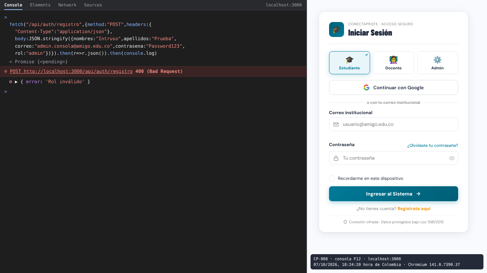
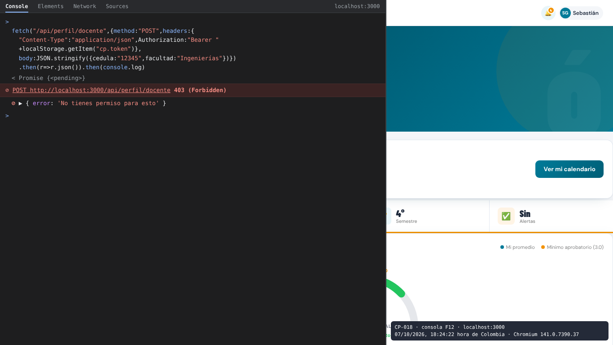
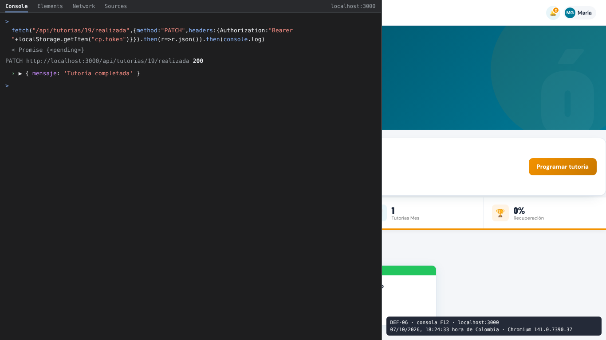
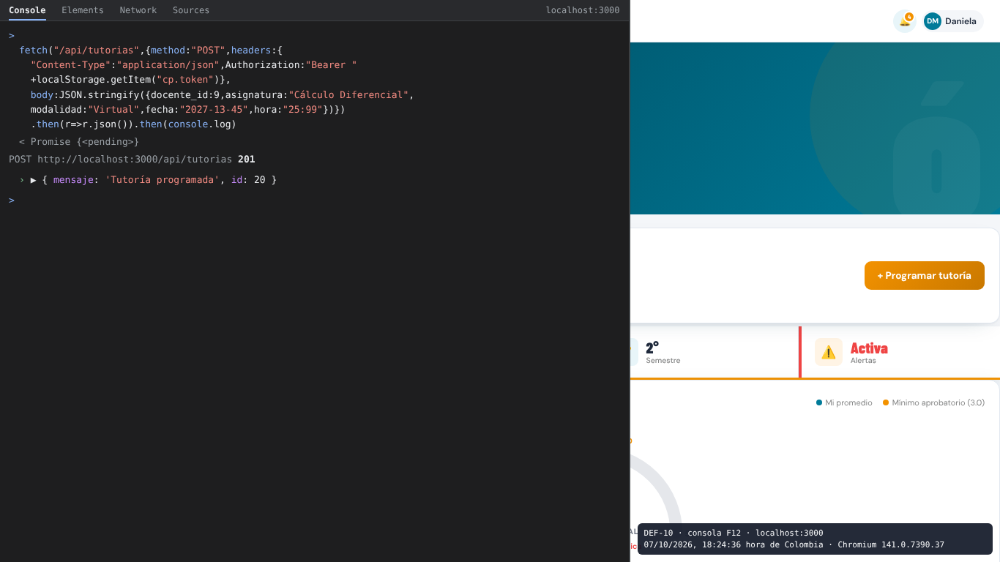
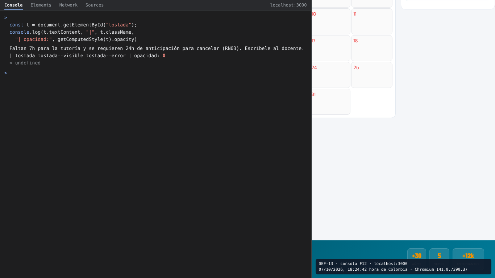

# Pruebas por consola del navegador (F12) — Equipo F

Estas son las pruebas que se hacen desde la pestaña **Consola** de las herramientas del navegador (F12), en https://profe-conecta-production-e40c.up.railway.app. En cinco se pega un `fetch()`: cuatro con el token de la sesión y el de CP-008 sin sesión, como lo haría un visitante. En la de DEF-13 se inspecciona el elemento del mensaje emergente con `document.getElementById()`.

- En DEF-06 hay que cambiar `ID` por el número de una tutoría cancelada (se ve en la pestaña Red) y entrar como su docente. En DEF-10, `docente_id` tiene que ser el de un docente activo.
- Firefox pide escribir `permitir pegar` antes de dejar pegar en la consola; Chrome pide `allow pasting`.
- La captura que va como evidencia es la de ustedes en Railway, con la consola abierta y la respuesta a la vista. La imagen que aparece debajo de cada comando es una **referencia de la copia local, no es evidencia**.

## CP-008 · Rechazo de registro con rol de administrador

**Requisito:** R1 · RRN02  
Un visitante intenta registrarse como administrador enviando la petición a mano.

```js
fetch("/api/auth/registro",{method:"POST",headers:{
  "Content-Type":"application/json"},
  body:JSON.stringify({nombres:"Intruso",apellidos:"Prueba",
  correo:"admin.consola@amigo.edu.co",contrasena:"Password123",
  rol:"admin"})}).then(r=>r.json()).then(console.log)
```

- **Resultado esperado:** La consola muestra {error: "Rol inválido"} y la pestaña Red, el código 400. No se crea la cuenta.

Referencia (copia local, no es evidencia):



## CP-018 · Un estudiante no puede guardar un perfil de docente

**Requisito:** R4 · RRN05  
Un estudiante autenticado intenta usar el endpoint de perfil de docente (control de acceso por rol).

```js
fetch("/api/perfil/docente",{method:"POST",headers:{
  "Content-Type":"application/json",Authorization:"Bearer "
  +localStorage.getItem("cp.token")},
  body:JSON.stringify({cedula:"12345",facultad:"Ingenierías"})})
  .then(r=>r.json()).then(console.log)
```

- **Resultado esperado:** La consola muestra {error: "No tienes permiso para esto"} y la pestaña Red, el código 403. No se crea ningún perfil de docente.

Referencia (copia local, no es evidencia):



## CP-021 · Rechazo de tutoría con docente inexistente

**Requisito:** R5 · R-03  
Se programa una tutoría con un docente que no existe; el servidor debe responder 404 sin caerse.

```js
fetch("/api/tutorias",{method:"POST",headers:{
  "Content-Type":"application/json",Authorization:"Bearer "
  +localStorage.getItem("cp.token")},
  body:JSON.stringify({docente_id:999999,
  asignatura:"Cálculo Diferencial",modalidad:"Virtual",
  fecha:"2027-02-15",hora:"10:00"})}).then(r=>r.json()).then(console.log)
```

- **Resultado esperado:** La consola muestra {error: "Docente no encontrado o inactivo"} y la pestaña Red, el código 404. Al recargar, la página carga normal: el servidor sigue arriba (no hay error 500).

Referencia (copia local, no es evidencia):


## DEF-06 · Una tutoría cancelada se marca «completada» por la API

**Requisito:** R6  
Una tutoría ya cancelada no debería admitir nuevas transiciones; por la API se puede marcar «realizada».

```js
fetch("/api/tutorias/ID/realizada",{method:"PATCH",headers:{Authorization:"Bearer "+localStorage.getItem("cp.token")}}).then(r=>r.json()).then(console.log)
```

- **Resultado esperado:** R6: una tutoría cancelada no admite nuevas transiciones. El servidor rechaza el cambio con un error y la tutoría sigue «cancelada».

Referencia (copia local, no es evidencia):



## DEF-10 · La API guarda tutorías con fechas y horas que no existen

**Requisito:** R5  
El servidor no valida que la fecha y la hora existan; acepta «2027-13-45» y «25:99».

```js
fetch("/api/tutorias",{method:"POST",headers:{
  "Content-Type":"application/json",Authorization:"Bearer "
  +localStorage.getItem("cp.token")},
  body:JSON.stringify({docente_id:9,asignatura:"Cálculo Diferencial",
  modalidad:"Virtual",fecha:"2027-13-45",hora:"25:99"})})
  .then(r=>r.json()).then(console.log)
```

- **Resultado esperado:** R5: el servidor rechaza una fecha o una hora que no existen (código 400 con un mensaje claro) y no guarda la tutoría.

Referencia (copia local, no es evidencia):



## DEF-13 · Los mensajes emergentes se generan pero nunca se ven

**Requisito:** RF028 · transversal  
Justo después de una acción que muestra un mensaje (cancelar una tutoría con menos de 24 horas), se inspecciona el elemento #tostada desde la consola, que es el paso 3 del reporte.

```js
const t = document.getElementById("tostada");
console.log(t.textContent, "|", t.className,
  "| opacidad:", getComputedStyle(t).opacity)
```

- **Resultado esperado:** RF028: el mensaje emergente se ve en pantalla (opacidad 1) y después desaparece solo.

Referencia (copia local, no es evidencia):


